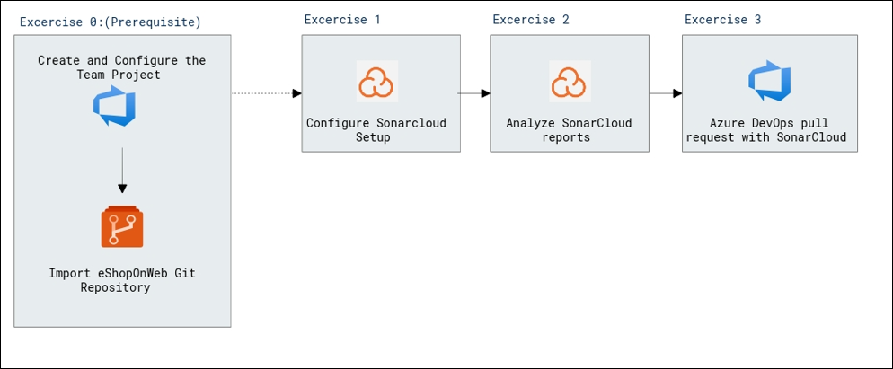

# Lab Scenario Preview: AZ-400: Implement security and validate code bases for compliance - Part B

## Lab 14: Managing technical debt with SonarCloud and Azure DevOps

### Lab overview

In the context of Azure DevOps, the term *technical debt* represents suboptimal means of reaching tactical goals, which negatively affects the ability to achieve strategic objectives in the area of software development and deployment. Technical debt affects productivity by making code hard to understand, prone to failures, time-consuming to change, and difficult to validate. Without proper oversight and management, technical debt can accumulate over time and significantly impact the overall quality of the software and the productivity of development teams in the longer term.

[SonarCloud](https://sonarcloud.io/) is a cloud-based code quality and security service. The main features of SonarCloud include:

- Support for 23 programming and scripting languages, including Java, JS, C#, C/C++, Objective-C, TypeScript, Python, ABAP, PLSQL and T-SQL.
- Thousands of rules to track down hard-to-find bugs and quality issues based on powerful static code analyzers.
- Cloud-based integrations with popular CI services, including Travis, Azure DevOps, BitBucket, and AppVeyor.
- Deep code analysis for exploring all source files in branches and pull requests, helping reach a green Quality Gate and promote the build.
- Speed and scalability.

In this lab, you will learn how to integrate Azure DevOps Services with SonarCloud.

> **Note**: Before you run this lab, ensure that you have the ability to run Azure DevOps pipelines. Due to the change to public projects that took place in February 2021, access to pipelines will need to be requested: https://devblogs.microsoft.com/devops/change-in-azure-pipelines-grant-for-public-projects/

### Objectives

After you complete this lab, you will be able to:

- Setup an Azure DevOps project and CI build to integrate with SonarCloud
- Analyze SonarCloud reports
- Integrate static analysis into the Azure DevOps pull request process

### Architecture Diagram

   

>**Note**: Once you understand the lab's content, you can start the Hands-on Lab by clicking the **Launch** button located at the top right corner which leads you to the lab environment and lab guide interface. You can also have a detailed preview of the full lab guide [here](https://experience.cloudlabs.ai/#/labguidepreview/ce308720-6112-4d96-8d0e-b03883318ba5), prior to launching your environment.
